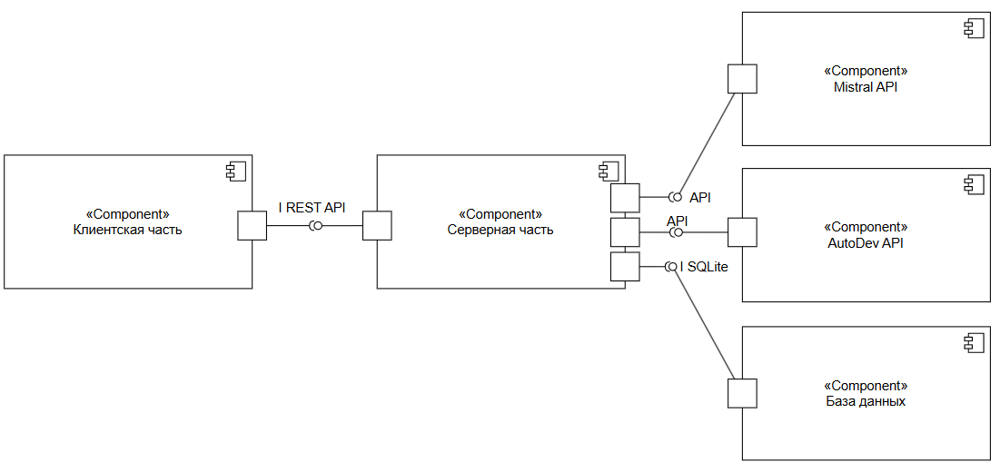
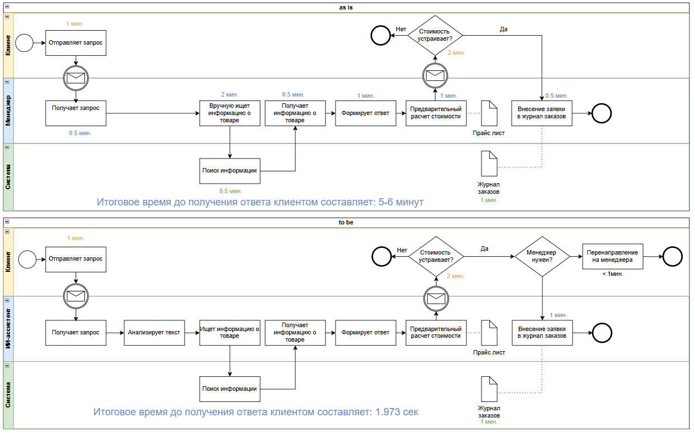
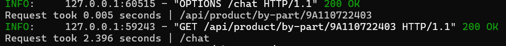
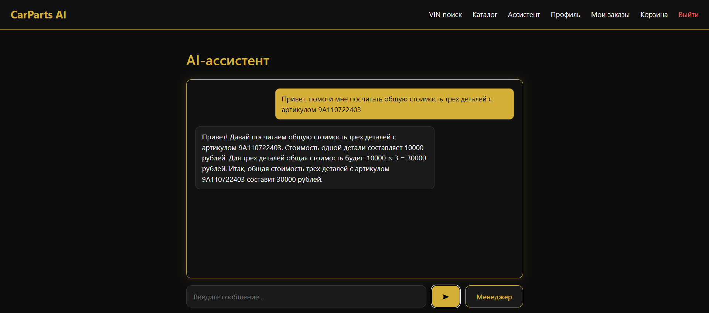
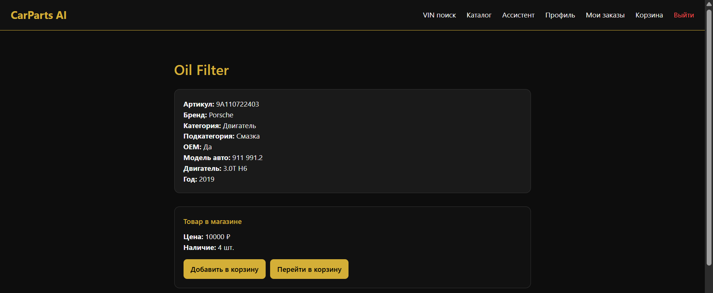
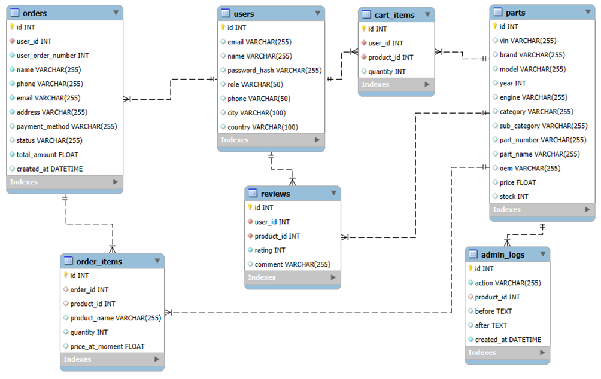
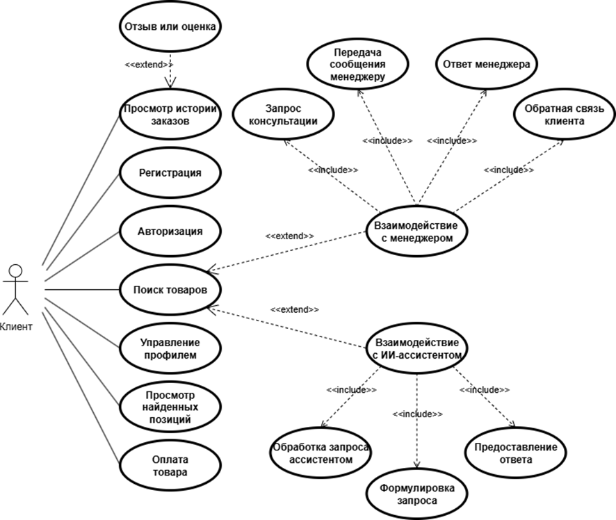
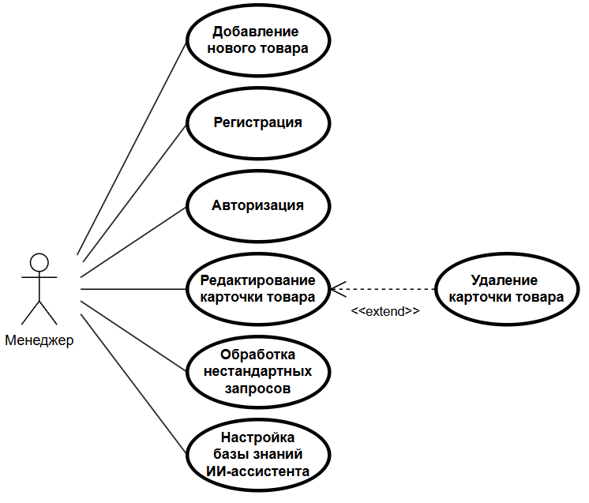

# CarParts AI — интеллектуальный ассистент для подбора автозапчастей

CarParts AI — это веб‑платформа с ИИ‑ассистентом, который помогает пользователям подбирать автозапчасти по VIN‑коду, названию детали или описанию проблемы.  
Проект разработан в рамках выпускной квалификационной работы и включает backend на FastAPI и frontend на React.

---

## 🚀 Основные возможности

### 🤖 ИИ‑ассистент
- Понимает естественный язык  
- Подбирает детали по VIN  
- Уточняет запросы  
- Ведёт диалог с пользователем  
- Может объяснять характеристики и совместимость деталей  

### 🛒 Интернет‑магазин автозапчастей
- Каталог товаров  
- Фильтрация и поиск  
- Корзина  
- Оформление заказа  
- История заказов  
- Отзывы и рейтинги  

### 👤 Личный кабинет
- Регистрация и авторизация (JWT)  
- Редактирование профиля  
- Просмотр заказов  

### 🛠 Панель администратора
- Управление товарами  
- Управление заказами  
- Просмотр логов  
- Управление отзывами  

---

---

## 📊 Диаграммы проекта

### Компонентная диаграмма


### AS‑IS и TO‑BE архитектура


## Подтверждение скорости работы

### Логи FastAPI


### Окно чата


### Окно карточки товара


### ER‑диаграмма базы данных


### Use Case диаграмма (клиент)


### Use Case диаграмма (менеджер)


---

## 🧩 Архитектура проекта

Проект разделён на две части: backend и frontend.

### Backend (FastAPI)

Backend реализует бизнес‑логику, работу с базой данных, авторизацию, обработку запросов и ИИ‑агентов.  
Основные модули:

- **auth** — регистрация, авторизация, JWT‑токены, схемы пользователей, безопасность.  
- **products** — каталог товаров, получение списка запчастей, фильтрация, поиск.  
- **reviews** — создание и отображение отзывов, рейтинги.  
- **orders** — оформление заказов, статусы, получение истории заказов.  
- **cart** — логика корзины: добавление, удаление, изменение количества.  
- **processing** — ИИ‑агенты: VIN‑агент, классификатор запросов, текстовый агент, агент уточнений.  
- **utils** — вспомогательные функции: JWT‑утилиты, логирование, безопасность.  
- **database** — SQLAlchemy‑модели, подключение к базе данных, зависимости.  
- **main.py** — точка входа FastAPI, подключение роутов и конфигурация приложения.  

### Frontend (React + Vite)

Frontend отвечает за интерфейс и взаимодействие с API.  
Основные части:

- **pages** — страницы приложения: каталог, корзина, профиль, авторизация, админ‑панель, ассистент.  
- **components** — UI‑компоненты: навигация, карточки товаров, формы, защищённые маршруты.  
- **api** — модуль для общения с backend: авторизация, товары, заказы, отзывы, ассистент.  
- **styles** — стили приложения.  

---

## 🧠 Архитектура ИИ‑ассистента

ИИ‑часть проекта построена на наборе специализированных агентов:

- **VIN‑агент** — извлекает данные по VIN‑коду.  
- **Классификатор** — определяет тип пользовательского запроса.  
- **Текстовый агент** — формирует ответы на вопросы.  
- **Агент уточнений** — задаёт уточняющие вопросы при недостатке информации.  
- **Агент статей** — формирует расширенные текстовые ответы.  

Каждый агент выполняет свою задачу, а маршрутизатор определяет, какой агент должен обработать конкретный запрос.


---

## 🗄 Структура базы данных

Проект использует SQLite и SQLAlchemy ORM.  
Основные сущности:

- Пользователь  
- Товар  
- Отзыв  
- Заказ  
- Позиция заказа  
- Корзина  
- Логи действий  


---

## 🛠 Используемые технологии

### Backend
- FastAPI  
- SQLAlchemy  
- Pydantic  
- JWT (python-jose)  
- bcrypt (passlib)  
- Requests  
- python-dotenv  

### Frontend
- React  
- Vite  

### Тестирование
- pytest  
- pytest-asyncio  
- httpx  

---

## ⚙️ Установка и запуск

### 1. Клонирование репозитория

```bash
git clone https://github.com/asadykov1210/CarParts-AI
cd CarParts-AI
